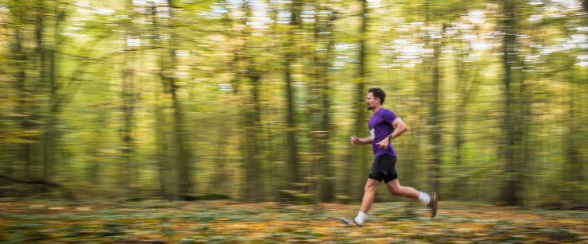

Witaj na moim blogu! 🚴‍♂️🏊‍♂️🏃‍♂️
Tutaj dokumentuję swoją drogę do Ironman 2026 – treningi, odżywianie, sprzęt i co tam jeszcze wpadnie mi do głowy.
Wydaje się, że forma osobistego bloga może być nieco staroświecka, ale who cares?
Robię to dla siebie i stanowi to dla mnie ważny element mojej podróży.

Krótko o mnie:
- od 20 lat trenuję siłowo
- trening siłowy dał mi dobrą bazę dla innych dyscyplin
- od 3 lat biegam i startuję w półmaratonach, od roku jeżdżę na rowerze
- bieganie i kolarstwo są dla mnie źródłem nowych wyzwań, satysfakcji i radości
- zasadniczo potrzebuję stawiać sobie poprzeczkę coraz wyżej
- chcę też bardziej holistycznie zadbać o swoje zdrowie
- nigdy wcześniej nie startowałem w triathlonie
- przygotowania do startu to dodatek do mojego stylu życia, a nie jego główny element
- stąd pora na kolejne wyzwanie – Ironman 2026!
- jestem podekscytowany wizją tej przygody, czekającą mnie nauką, ale jestem gotowy na ciężką pracę, która mnie czeka
